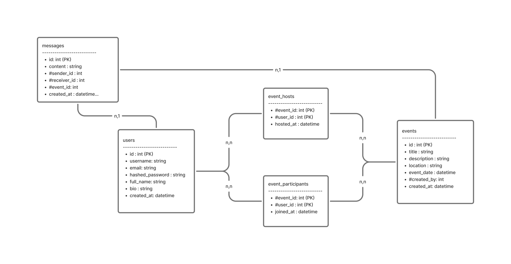

# Dossier de Conception - Frontend

# Dossier de Conception - Backend (equ 3 pages )

## Introduction

Ce document présente la conception du backend pour une application de mise en relation de musiciens. Il couvre la modélisation des données, les API utilisées, ainsi que les spécifications fonctionnelles et techniques.

## Modélisation des Données

### Schéma 

### Modèles SQLAlchemy

- **User**: Représente un utilisateur (musicien) avec les attributs suivants :
  - `id`: Identifiant unique.
  - `username`: Nom d'utilisateur unique.
  - `email`: Adresse email unique.
  - `hashed_password`: Mot de passe haché.
  - `full_name`: Nom complet (optionnel).
  - `bio`: Biographie (optionnel).
  - `created_at`: Date de création.

- **Event**: Représente un événement musical avec les attributs suivants :
  - `id`: Identifiant unique.
  - `title`: Titre de l'événement.
  - `description`: Description de l'événement.
  - `location`: Lieu de l'événement.
  - `event_date`: Date et heure de l'événement.
  - `created_by`: Identifiant de l'utilisateur créateur.
  - `created_at`: Date de création.

- **Message**: Représente un message envoyé concernant un événement :
  - `id`: Identifiant unique.
  - `content`: Contenu du message.
  - `sender_id`: Identifiant de l'expéditeur.
  - `receiver_id`: Identifiant du receveur.
  - `event_id`: Identifiant de l'événement associé.
  - `created_at`: Date de création.

- **EventParticipants**: Table de liaison pour les participants à un événement :
  - `event_id`: Identifiant de l'événement.
  - `user_id`: Identifiant de l'utilisateur participant.
  - `joined_at`: Date de participation.

- **EventHosts**: Table de liaison pour les hôtes d'un événement :
  - `event_id`: Identifiant de l'événement.
  - `user_id`: Identifiant de l'utilisateur hôte.
  - `hosted_at`: Date d'hébergement.

### Relations

- Un utilisateur peut créer plusieurs événements.
- Un événement peut avoir plusieurs messages.
- Un événement peut avoir plusieurs participants et hôtes.

> Il y a une route, une fois l'api lancé, `http://localhost:8000/docs` qui est une documentation Swagger avec l'intégralité des routes.

## Description outils utilisés

### FastAPI

- **Framework**: FastAPI est utilisé pour construire l'API en raison de sa rapidité et de sa facilité d'utilisation.
- **Endpoints**: Les endpoints sont définis pour l'authentification, la gestion des utilisateurs et des événements.
- **Authentification**: Utilisation de JWT pour sécuriser les endpoints.

### SQLAlchemy

- **ORM**: SQLAlchemy est utilisé pour l'interaction avec la base de données PostgreSQL.
- **Sessions**: Gestion des sessions de base de données pour les opérations CRUD.

### Autres Bibliothèques

- **Pydantic**: Pour la validation des données.
- **Passlib**: Pour le hachage des mots de passe.
- **PyJWT**: Pour la gestion des tokens JWT.

## Spécifications Fonctionnelles

### Authentification

- Enregistrement des utilisateurs avec email et mot de passe.
- Connexion des utilisateurs et génération de tokens JWT.
- Rafraîchissement des tokens d'accès.
- Déconnexion (côté client).

### Gestion des Utilisateurs

- Création, lecture et mise à jour des informations utilisateur.
- Récupération des informations de l'utilisateur connecté.

### Gestion des Événements

- Création, lecture et participation aux événements.
- Envoi de messages concernant les événements.

## Spécifications Techniques

### Environnement de Développement

- **Docker**: Utilisation de Docker pour containeriser l'application.
- **Devcontainer**: Configuration pour Visual Studio Code pour un environnement de développement isolé.
- **Base de Données**: PostgreSQL pour la persistance des données.

### Sécurité

- **Hachage des Mots de Passe**: Utilisation de bcrypt pour hacher les mots de passe.
- **JWT**: Tokens pour l'authentification et l'autorisation.
- **CORS**: Configuration pour permettre les requêtes depuis des origines spécifiques.

### Tests

- **Pytest**: Utilisation de Pytest pour les tests.
- **Couverture de Code**: Utilisation de pytest-cov pour mesurer la couverture de code.