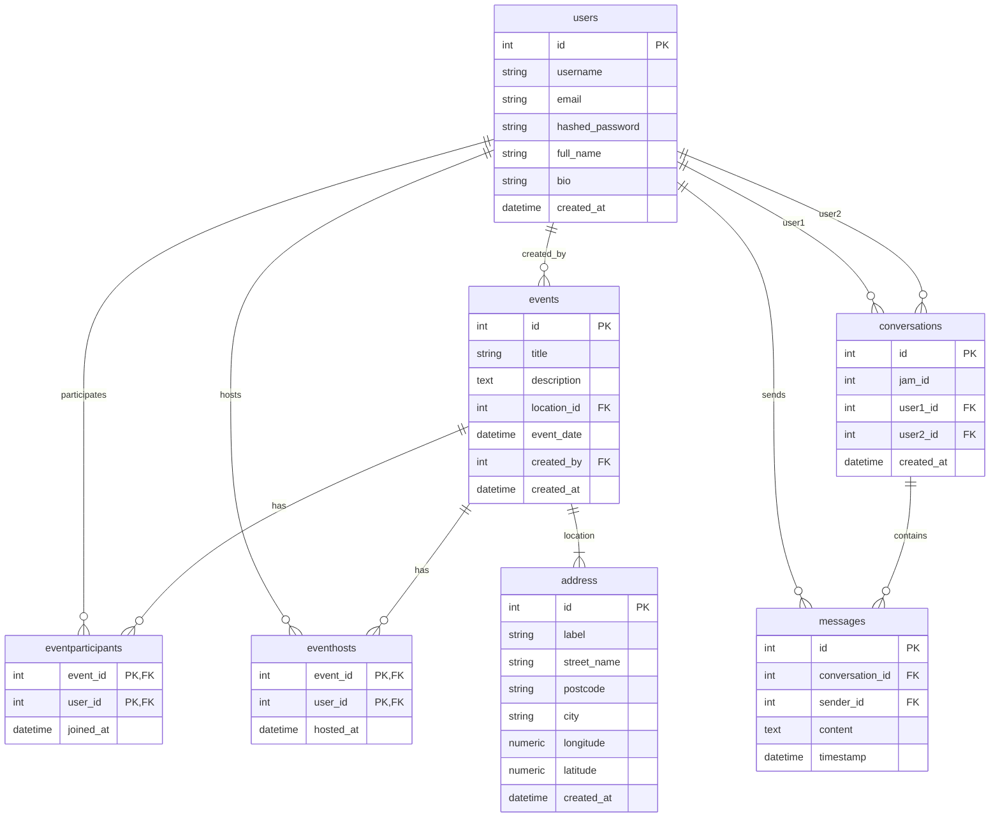
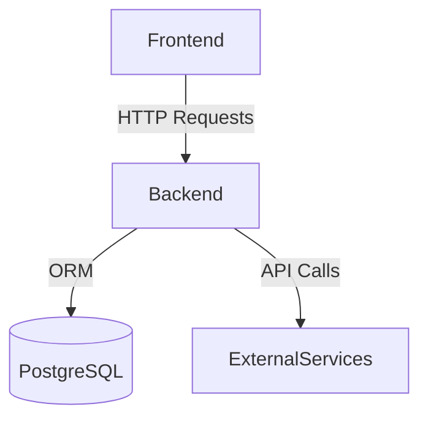

# Dossier de Conception - Backend et Frontend

# Documentation du Projet Mobile Musician

## Choix architecturaux

**Architecture utilisée :** Clean Architecture + MVC modulaire

**Justification :**
- Séparation claire des couches (modèles, routes, schémas, core)
- Facilité de maintenance et de tests
- Évolutivité du projet
- Adapté à une API REST avec FastAPI
- Isolation des dépendances (la couche "core" contient les configurations)

La structure en modules (`auth`, `users`, `events`, etc.) permet une bonne organisation du code et une séparation des responsabilités.

## Modèle de données



## Choix techniques
Principaux outils :
* Backend : 
    * FastAPI, SQLAlchemy, Pydantic
    * Base de données : PostgreSQL
    * Authentification : JWT (JSON Web Tokens)
    * Tests : Pytest
    * Développement : Docker, VSCode Dev Containers
* Frontend :
    * React native (react native maps, expo...)
    * TamagUI pour les variables et le style
    * Structure de l'app en Atomic design
    * Zustand pour le store
    * Axios pour la gestion d'API

### Schéma d'interactions :



## Spécifications fonctionnelles développées

Authentification :
* Inscription/connexion utilisateur
* Gestion des tokens JWT (access + refresh)
* Protection des routes

Gestion des utilisateurs :
* CRUD utilisateurs
* Profil utilisateur
* Gestion des événements :
* Création/modification/suppression d'événements
* Participation aux événements
* Système d'hôtes/participants

Gestion des conversations :
* Création de conversations entre utilisateurs
* Envoi de messages

Gestion des adresses :
* CRUD des adresses
* Coordonnées

## Extrait de code commenté
```python
# /back/app/core/security.py - Fonction d'authentification

def authenticate_user(db: Session, email: str, password: str) -> Optional[User]:
    """Authentifier un utilisateur par email et mot de passe
    
    Args:
        db: Session SQLAlchemy
        email: Email de l'utilisateur
        password: Mot de passe en clair
    
    Returns:
        User: L'utilisateur authentifié ou None
    """
    # Recherche l'utilisateur par email
    user = db.query(User).filter(User.email == email).first()
    
    # Vérifie si l'utilisateur existe et si le mot de passe correspond
    if not user or not verify_password(password, user.hashed_password):
        return None
        
    return user
```

## Test développé
```python
# /back/tests/test_integration.py - Test du flux complet

def test_user_registration_and_login_flow(client):
    # 1. Enregistrement
    user_data = {
        "username": "testuser",
        "email": "test@example.com",
        "password": "testpass",
        "full_name": "Test User"
    }
    register_response = client.post("/auth/register", json=user_data)
    assert register_response.status_code == 201
    
    # 2. Connexion
    login_response = client.post("/auth/login", json={
        "email": user_data["email"],
        "password": user_data["password"]
    })
    assert login_response.status_code == 200
    tokens = login_response.json()
    
    # 3. Accès protégé
    headers = {"Authorization": f"Bearer {tokens['access_token']}"}
    me_response = client.get("/auth/me", headers=headers)
    assert me_response.status_code == 200
    assert me_response.json()["email"] == user_data["email"]
```
## Déploiement (à faire)
Procédure de déploiement :
* Hébergement : Docker sur un VPS ou service cloud (AWS, GCP, Azure)

Configuration :
* Créer un fichier .env avec les variables nécessaires
* Configurer la base de données PostgreSQL

Commandes (après avoir créer une image de prod plus légère et sécurisé ) :
```bash
docker-compose up -d --build
```
Base de données :
* Initialiser avec le script `fakedata.sql` ou rien
* Migrations via Alembic (à implémenter)

###  Configuration minimale :

* 1 CPU, 2GB RAM
* 10GB de stockage
* PostgreSQL 15+

